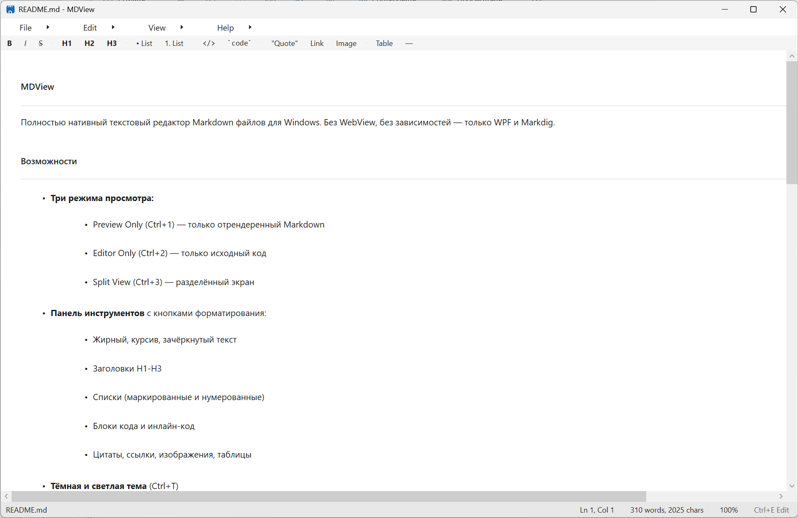

# MDView



Полностью нативный текстовый редактор Markdown файлов для Windows. Без WebView, без зависимостей — только WPF и Markdig.

## Возможности

- **Три режима просмотра:**
  - Preview Only (Ctrl+1) — только отрендеренный Markdown
  - Editor Only (Ctrl+2) — только исходный код
  - Split View (Ctrl+3) — разделённый экран

- **Панель инструментов** с кнопками форматирования:
  - Жирный, курсив, зачёркнутый текст
  - Заголовки H1-H3
  - Списки (маркированные и нумерованные)
  - Блоки кода и инлайн-код
  - Цитаты, ссылки, изображения, таблицы

- **Тёмная и светлая тема** (Ctrl+T)

- **Масштабирование** (Ctrl+±, Ctrl+0)

- **Кнопка Copy** на каждом блоке кода в предпросмотре

- **Портативность** — настройки сохраняются в `settings.ini` рядом с exe
- **Ассоциация файлов** — двойной клик по .md файлу открывает его в MDView
- **Запоминание позиции окна** — окно открывается там, где вы его закрыли

## Горячие клавиши

| Клавиша | Действие |
|---------|----------|
| Ctrl+N | Новый файл |
| Ctrl+O | Открыть файл |
| Ctrl+S | Сохранить |
| Ctrl+Shift+S | Сохранить как |
| Ctrl+P | Переключить режим просмотра |
| Ctrl+1 | Preview Only |
| Ctrl+2 | Editor Only |
| Ctrl+3 | Split View |
| Ctrl+T | Переключить тему |
| Ctrl+B | Жирный |
| Ctrl+I | Курсив |
| Ctrl+K | Вставить ссылку |
| Ctrl+± | Масштаб |
| Ctrl+0 | Сброс масштаба |

## Системные требования

- Windows 10/11
- .NET 8.0 Runtime (скачать: https://dotnet.microsoft.com/en-us/download/dotnet/8.0)

## Сборка

```powershell
.\build.ps1
```

Или вручную:

```powershell
dotnet publish src/NativeMDView.csproj -c Release -r win-x64 --self-contained true -p:PublishSingleFile=true -p:PublishReadyToRun=true -o dist
```

Готовый exe: `dist/MDView.exe`

## Архитектура

Приложение использует библиотеку **Markdig** для парсинга Markdown в AST, а затем рендерит AST напрямую в нативные WPF-элементы (TextBlock, Border, Grid, Image и т.д.). Никакого WebView, никакого HTML — всё нативно.

```
Markdown → Markdig Parser → AST → MarkdownRenderer → WPF UI Elements → ScrollViewer
```

## Лицензия

MIT
